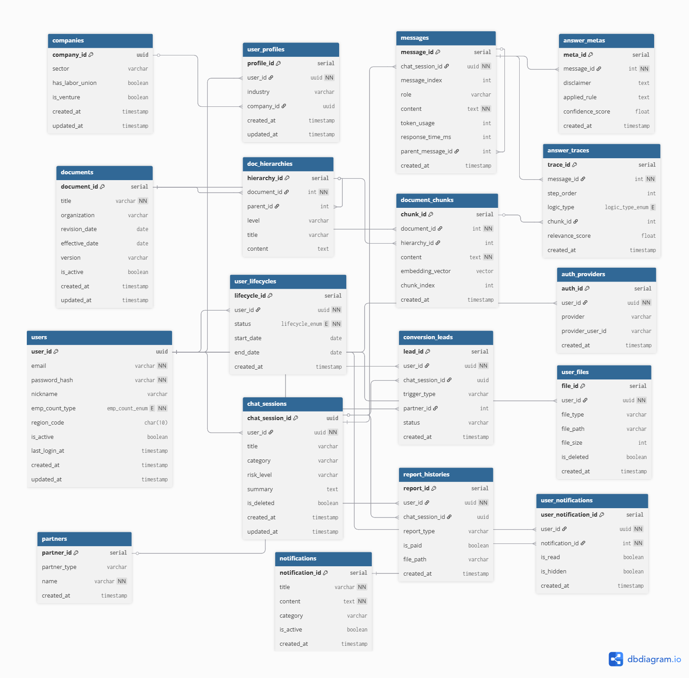

# ⚖️ Legal-Mind-RAG
> **근로자를 위한 지능형 노무 상담 비서**  
> "내 월급, 내 휴가, 내 아이를 위한 권리까지—AI가 최신 법령과 판례로 답변합니다."

---

## 📅 작성일
- 2026-03-10 (최종 수정: 2026-03-20)

---

## 🎯 1. 프로젝트 기획 의도
- **정보 비대칭 해소:** 복잡한 근로기준법을 근로자의 눈높이에서 해석하여 정당한 권리를 찾도록 돕습니다.
- **RAG 기반 신뢰성:** AI의 환각(Hallucination)을 방지하기 위해 반드시 **고용노동부 공식 가이드북 및 최신 판례**를 근거로 답변합니다.
- **균형 잡힌 전문성:** 임금, 근로시간, 해고뿐만 아니라 상대적으로 정보가 부족한 **임신·출산·육아 관련 노무 지식**을 동등한 비중으로 다룹니다.

---

## 🏗️ 2. 시스템 설계 핵심 (Business Logic)

### ⚖️ 4대 핵심 도메인 (Coverage)
1. **임금/수당:** 주휴수당, 퇴직금, 포괄임금제 분석.
2. **근로시간/휴가:** 52시간제 준수 여부 및 연차 유급휴가 계산.
3. **고용보장/해고:** 부당해고 판례 매칭 및 실업급여 수급 자격 진단.
4. **일·가정 양립:** 임신/육아기 단축근무, 육아휴직 및 복직 후 권리 보호.

---

## 🛠️ 3. 기술 스택 (Tech Stack)

| 분류 | 사용 기술 (Stack) | 주요 역할 및 강점 (Description) |
| :--- | :--- | :--- |
| **Backend** | Python 3.11+, FastAPI | 비동기 처리로 빠른 API 응답 속도 및 서버 성능 확보 |
| | Pydantic / SQLAlchemy | 강력한 데이터 타입 검증 및 안정적인 DB 객체 관계 매핑 |
| **Frontend** | React 18 / JSX | 선언적 UI 설계를 통한 가독성 증대 및 현대적 웹 표준 기반 개발 |
| | Vite / CSS Modules | 최적화된 빌드 환경 및 독립적 스타일링으로 유지보수 용이 |
| **AI & LLM** | LangChain / RAG | 법령 기반 지식 베이스 구축으로 환각 방지 및 분석 자동화 |
| | GPT-4o, Claude 3.5 | 시나리오 기반 맞춤형 전략 수립 및 고도화된 컨설팅 로직 수행 |
| **Database** | PostgreSQL | 유저 정보 및 대시보드 데이터의 정교한 관계형 데이터 설계 |
| | ChromaDB | 법령/판례 데이터 벡터화를 통한 유사도 기반 검색 엔진 |

---

## 📂 4. 프로젝트 폴더 구조

### 🔹 Backend (Python/FastAPI)

```text
legal-mind-rag/
├── app/                        # [애플리케이션 핵심]
│   ├── api/                    # API 경로 (URL 주소 설정)
│   │   └── v1/                 # 버전 관리
│   │       └── endpoints/      # 실제 대화/질문 API 로직
│   ├── core/                   # 설정 (OpenAI 키, 보안 설정)
│   ├── database/               # DB 연결 (Vector DB, RDBMS)
│   ├── services/               # 비즈니스 로직 (RAG 엔진)
│   ├── schemas/                # 데이터 규격 (Pydantic 모델)
│   ├── models/                 # DB 테이블 구조 정의 (SQLAlchemy)
│   └── main.py                 # FastAPI 실행 입구
├── data/                       # [데이터 저장소]
│   ├── raw/                    # 법령/판례 PDF 원본
│   ├── processed/              # AI용 가공 데이터
│   └── vectorstore/            # ChromaDB 데이터 저장소
├── docs/                       # [문서화] 기획서, 설계도, API 문서
├── tests/                      # [검증] 코드 테스트용 파일들
├── scripts/                    # [관리] 데이터 파이프라인 스크립트
├── .env                        # [보안] API 키 보관
├── .gitignore                  # [관리] Git 제외 목록
├── requirements.txt            # [설치] 의존성 라이브러리 목록
└── README.md                   # [대문] 프로젝트 소개
```

### 🔹 Frontend (React/Tailwind CSS) - 추후 확장 예정

```text
legal-mind-frontend/
├── src/
│   ├── components/             # UI 컴포넌트 (ChatWindow 등)
│   ├── hooks/                  # API 통신 및 상태 로직 분리
│   ├── pages/                  # 메인 채팅 및 서비스 페이지
│   ├── services/               # 백엔드와 통신하는 함수
│   ├── styles/                 # Tailwind CSS 스타일 설정
│   └── utils/                  # 유틸리티 (날짜 변환 등)
├── tailwind.config.js          # Tailwind 설정
└── package.json                # 라이브러리 관리
```

---

## 💰 5. 비즈니스 모델 (Revenue Model)

*   **인프라 매칭 수수료 (B2B):** 시뮬레이션 결과와 연계된 검증된 스마트 기기/솔루션 업체 매칭.
*   **B2B 전략 제휴:** 소상공인 대상 세무, 법률, 마케팅 서비스와의 정보성 연계 및 광고 모델.
*   **심화 분석 리포트 (Future):** AI 진단을 넘어선 정밀 경영 진단 및 심화 리포트 서비스.

---

## 📂 6. 문서 바로가기 (Documentation)

> 아래 항목을 클릭하면 해당 상세 설계 문서(`docs/` 폴더 내 파일)로 이동합니다.

*   [01_기획 및 요구사항](docs/01_concept_and_requirements.md)
*   [02_시스템 아키텍처](docs/02_system_architecture.md)
*   [03_데이터 설계](docs/03_data_design_spec.md)
*   [04_프론트엔드 및 UI/UX 설계](docs/04_frontend_plan.md)
*   [05_트러블슈팅 로그](docs/05_troubleshooting_log.md)
*   [06_실험 및 평가 보고서 (TBD)](docs/06_evaluation_report.md)

---

---

## 🏗️ 데이터베이스 설계 (ERD)

서비스의 핵심 비즈니스 로직과 RAG 근거 추적을 위한 데이터 구조입니다. `dbdiagram.io`를 활용하여 설계되었으며, 실제 DB 구현과 100% 일치합니다.

<p align="center">
  
</p>

> 💡 **상세 설계 명세:** 각 테이블의 컬럼 역할, 타입, ENUM 정의 등 상세한 내용은 [데이터 및 RAG 상세 설계서](./docs/03_data_design_spec.md)에서 확인하실 수 있습니다.

---

## 📈 7. 버전 관리 (Changelog)

## 📈 7. 버전 관리 (Changelog)

* **v0.2 (2026-03-23):** * 데이터베이스 상세 설계 완료 (ERD 시각화 및 images 폴더 자산화).
    * RAG 지식베이스 수집 및 청킹(Chunking) 전략 수립.
    * 도메인별 상세 명세서 작성 및 비즈니스 로직 정의 (`03_data_design_spec.md`).
* **v0.1 (2026-03-10):** 프로젝트 초기 기획 및 README/문서 구조 정의.