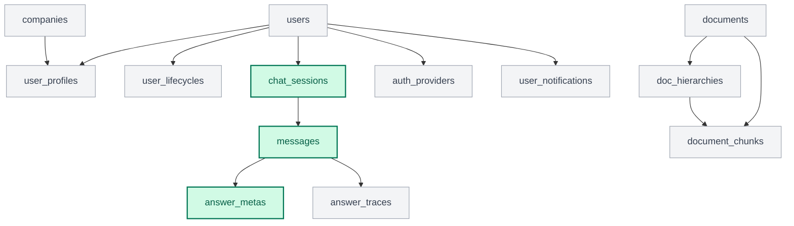

<!--
목적: RAG 지식베이스와 데이터 구조를 정의하되,
현재 구현 범위와 장기 설계를 구분해서 혼동을 줄인다.
-->

# 03. 데이터 및 RAG 상세 설계

본 문서는 Legal-Mind-RAG의 RAG 전략과 데이터 구조를 설명합니다.
중요한 점은, 아래 내용이 모두 "현재 구현 완료"를 의미하지는 않는다는 것입니다.

- **현재 구현 범위**: 상담 세션, 메시지, 답변 메타 중심
- **장기 설계 범위**: 사용자/기업/알림/문서 계층/벡터 저장소를 포함한 전체 ERD

---

## 1. 문서 해석 기준
이 문서는 두 층으로 읽어야 합니다.

1. **MVP에 바로 필요한 구조**
   - 질문 저장
   - 답변 저장
   - 답변의 근거/메타 추적

2. **서비스 확장을 위한 장기 구조**
   - 회원/기업/라이프사이클
   - 알림/리포트/소셜 로그인
   - 문서 원본 및 계층 구조 관리
   - 벡터 검색 최적화

---

## 2. RAG 지식베이스
AI가 답변의 근거로 삼을 문서와 처리 전략입니다.

### ① 수집 대상 문서
- **근로기준법/시행령**
- **남녀고용평등법**
- **2024~2026 고용노동부 가이드라인**
- **주요 판례 요약본**

### ② 전처리 전략
- **분할 단위**: 약 500~1,000자
- **중첩(Overlap)**: 약 100자
- **메타데이터**: 파일명, 페이지 번호, 조항 번호, 문서 식별자

### ③ 검색 방향
- 관련 조항과 문단을 검색해 답변 근거로 사용
- 답변 시 출처를 함께 노출
- 장기적으로는 유사도 검색 + 다양성 확보 전략 사용

### ④ 저장소 방향
- **현재 관계형 DB**: SQLite 기반 개발
- **장기 관계형 DB**: PostgreSQL 전환 고려
- **장기 벡터 저장소**: PostgreSQL + `pgvector` 방향
- **임베딩 모델 계획**: `text-embedding-3-small`

---

## 3. 현재 구현 기준 스키마
현재 코드베이스 기준으로 실제 존재하거나 가장 직접 연결된 모델입니다.

### [chat_sessions]
- 상담 단위 세션
- 주요 컬럼: `chat_session_id`, `user_id`, `title`, `category`, `risk_level`, `summary`, `is_deleted`

### [messages]
- 세션 내 개별 발화
- 주요 컬럼: `message_id`, `chat_session_id`, `message_index`, `role`, `content`, `token_usage`, `response_time_ms`, `parent_message_id`

### [answer_metas]
- AI 답변의 부가 정보
- 주요 컬럼: `meta_id`, `message_id`, `disclaimer`, `applied_rule`, `confidence_score`

### [answer_traces]
- 문서상 필요하지만 현재는 설계 단계에 가까움
- 목적: 어떤 문서 조각이 어떤 답변에 영향을 주었는지 추적

---

## 4. ERD 정리

### 4.1 장기 설계 ERD
당신이 만들어둔 기존 ERD는 현재 구현 스냅샷이라기보다, 서비스 전체 확장을 위한 장기 설계 ERD로 보는 것이 맞다.

즉, 이 ERD는 아래 역할을 가진다.
- 서비스가 최종적으로 갖추고 싶은 전체 데이터 구조를 보여준다.
- 사용자, 상담, 지식베이스, 알림, 인증까지 포함한 확장 방향을 담는다.
- 현재 코드 구현 상태와는 일부 차이가 있을 수 있다.

### 4.2 현재 사용 테이블 표시
아래 구조도는 장기 설계 테이블 집합 안에서 현재 코드상 직접 확인되는 테이블만 색으로 구분한 문서용 다이어그램이다.

- 초록색: 현재 코드에서 직접 확인되는 테이블
- 회색: 장기 설계에는 있으나 현재는 미구현 또는 부분 설계 상태인 테이블

현재 구현 기준에서 직접 확인되는 테이블은 아래 세 개다.
- `chat_sessions`
- `messages`
- `answer_metas`

추가로 `answer_traces`는 장기 설계에는 포함되지만 현재 코드에서는 주석 처리 상태다.

### 4.3 현재 구현과의 차이
현재 코드와 장기 설계 ERD 사이에는 아래 차이가 있다.

- `chat_sessions.user_id` FK는 선언돼 있지만 실제 `users` 모델은 현재 저장소에 없다.
- `answer_traces`는 문서상 설계돼 있지만 현재 모델은 비활성 상태다.
- 현재 DB 설정은 SQLite인데 일부 모델은 PostgreSQL UUID 타입을 사용한다.
- `app.models.chat`가 참조하는 `app.database.session.Base`가 현재 저장소에 없다.

즉, 장기 ERD 자체를 폐기할 필요는 없지만, "현재 구현 ERD"라고 읽히지 않게 분리해서 설명해야 한다.

### 👤 4-1. USER DOMAIN

#### [Users] 사용자 기본 정보
| 구분 | 컬럼명 | 역할 | 타입/옵션 | 출처 |
| :--- | :--- | :--- | :--- | :--- |
| **PK** | user_id | 사용자 고유 식별자 | UUID, NOT NULL | 시스템 |
| **UQ** | email | 로그인용 이메일 | VARCHAR, NOT NULL | 사용자 |
| **-** | password_hash | 암호화된 비밀번호 | VARCHAR, NOT NULL | 시스템 |
| **-** | nickname | 서비스 내 활동명 | VARCHAR | 사용자 |
| **ENUM**| emp_count_type | 상시 근로자 수 규모 | emp_count_enum | 사용자 |
| **-** | region_code | 법정동 코드 (10자리) | CHAR(10), 주석 참조 | 시스템 |
| **-** | is_active | 계정 활성화 여부 | BOOLEAN, Default: True | 시스템 |
| **-** | last_login_at | 최종 로그인 일시 | TIMESTAMP | 시스템 |
| **-** | created_at | 계정 생성 일시 | TIMESTAMP | 시스템 |
| **-** | updated_at | 정보 수정 일시 | TIMESTAMP | 시스템 |

#### [UserProfile, Companies, UserLifecycle]
| 테이블 | 역할 | 핵심 컬럼 |
| :--- | :--- | :--- |
| **UserProfile** | 산업군 및 소속 회사 관리 | `industry`, `company_id` (FK) |
| **Companies** | 기업 환경 정보 | `sector`, `has_labor_union`, `is_venture` |
| **UserLifecycle** | 임신/출산/육아 상태 추적 | `status` (ENUM), `start_date`, `end_date` |

---

### 💬 4-2. CONSULTATION DOMAIN

#### [ChatSession] 채팅 세션
| 구분 | 컬럼명 | 역할 | 타입/옵션 | 출처 |
| :--- | :--- | :--- | :--- | :--- |
| **PK** | chat_session_id | 세션 식별자 | UUID, NOT NULL | 시스템 |
| **FK** | user_id | 사용자 ID | UUID, Ref: Users | 시스템 |
| **-** | title | 상담 제목 | VARCHAR | AI 요약 |
| **-** | category | 상담 카테고리 | VARCHAR | AI 분류 |
| **-** | risk_level | 리스크 등급 | VARCHAR | AI 판단 |
| **-** | summary | 전체 대화 요약 | TEXT | AI 요약 |
| **-** | is_deleted | 삭제 여부 | BOOLEAN | 사용자 |

#### [Message] 개별 메시지
| 구분 | 컬럼명 | 역할 | 타입/옵션 | 출처 |
| :--- | :--- | :--- | :--- | :--- |
| **PK** | message_id | 메시지 식별자 | SERIAL, NOT NULL | 시스템 |
| **FK** | chat_session_id | 소속 세션 ID | UUID, Ref: ChatSessions | 시스템 |
| **-** | message_index | 세션 내 순서 | INT | 시스템 |
| **-** | role | 발화 주체(user/ai/system) | VARCHAR | 시스템 |
| **-** | content | 메시지 내용 | TEXT, NOT NULL | 사용자/AI |
| **-** | token_usage | 토큰 사용량 | INT | 시스템 |
| **FK** | parent_message_id | 부모 메시지 ID | INT, Self-Ref | 시스템 |

#### [AnswerMeta & AnswerTrace]
- **역할**: AI 답변의 신뢰도와 법적 근거(RAG)를 추적합니다.
- **핵심 컬럼**: `disclaimer`, `applied_rule`, `logic_type`, `relevance_score`.

---

### 📚 4-3. KNOWLEDGE BASE & EXTENSIONS

#### [Document & DocHierarchy & DocumentChunk]
- **역할**: 법령 계층 구조(`level`)와 벡터 검색용 조각(`embedding_vector`) 관리.

#### [Notification, BM, Report, Auth]
- **Notification**: 알림 및 수신 상태(`is_read`) 관리.
- **Partners/Lead**: 전문가 정보 및 비즈니스 전환(`status`) 추적.
- **Report/File**: 리포트 이력 및 사용자 업로드 파일 관리.
- **AuthProvider**: 소셜 로그인(`provider`, `provider_user_id`) 연동.

---

## 5. 도메인별 상세 비고
본 섹션은 장기 모델링 시 참고하는 가이드입니다.

### 👤 5-1. USER DOMAIN

| 구분 | 테이블 | 컬럼명 | 역할 | 타입/옵션 | 비고 |
| :--- | :--- | :--- | :--- | :--- | :--- |
| **PK** | **users** | `user_id` | 사용자 식별자 | UUID, NN | 보안을 위한 고유 키 (ID 유추 방지) |
| **UQ** | | `email` | 로그인 계정 | VARCHAR, NN | 중복 가입 방지용 고유 이메일 |
| **ENUM**| | `emp_count_type` | 근로자 규모 | enum | **5인 미만 사업장 판단** (법 적용 핵심 기준) |
| **FK** | **user_profiles**| `user_id` | 사용자 연결 | UUID, NN | `users` 테이블과 1:1 관계 형성 |
| **FK** | | `company_id` | 기업 연결 | UUID | 사용자가 속한 기업 정보와 연결 |
| **PK** | **companies** | `company_id` | 기업 식별자 | UUID, NN | 기업별 노무 환경(업종, 노조유무) 관리 |
| **PK** | **user_lifecycles**| `lifecycle_id`| 상태 식별자 | SERIAL, NN | 시계열적 노무 상태 관리 |
| **ENUM**| | `status` | 현재 상태 | enum, NN | 임신, 출산, 육아 중인 상태 구분 |

### 💬 5-2. CONSULTATION DOMAIN

| 구분 | 테이블 | 컬럼명 | 역할 | 타입/옵션 | 비고 |
| :--- | :--- | :--- | :--- | :--- | :--- |
| **PK** | **chat_sessions**| `chat_session_id`| 세션 식별자 | UUID, NN | 하나의 채팅방(상담 주제) 단위 |
| **-** | | `risk_level` | 위험 등급 | VARCHAR | AI가 요약한 법적 분쟁 위험도 |
| **PK** | **messages** | `message_id` | 메시지 식별자 | SERIAL, NN | 개별 발화 기록 (순서 보장) |
| **FK** | | `chat_session_id`| 세션 연결 | UUID, NN | 어느 대화방에 속한 메시지인지 구분 |
| **FK** | | `parent_message_id`| 부모 메시지 | INT | 대화의 계층 구조 및 맥락 연결 (Self-Ref) |
| **PK** | **answer_metas** | `meta_id` | 답변 메타 ID | SERIAL, NN | 면책공고 및 참고 법규 텍스트 저장 |
| **PK** | **answer_traces** | `trace_id` | RAG 추적 ID | SERIAL, NN | **검색된 조각(Chunk)과의 연관성 점수** 기록 |

### 📚 5-3. KNOWLEDGE BASE & EXTENSIONS

| 구분 | 테이블 | 컬럼명 | 역할 | 타입/옵션 | 비고 |
| :--- | :--- | :--- | :--- | :--- | :--- |
| **PK** | **documents** | `document_id` | 원본 문서 ID | SERIAL, NN | 수집된 법령 PDF 등 원본 소스 관리 |
| **PK** | **doc_hierarchies**| `hierarchy_id` | 계층 구조 ID | SERIAL, NN | 편-장-절-조-항의 법률 구조화 관리 |
| **PK** | **document_chunks**| `chunk_id` | 검색 조각 ID | SERIAL, NN | 벡터 검색을 위해 쪼개진 텍스트 단위 |
| **-** | | `embedding_vector`| 벡터 데이터 | VECTOR | AI 연산을 위한 수치형 임베딩 값 |
| **PK** | **auth_providers**| `auth_id` | 소셜 인증 ID | SERIAL, NN | 카카오/구글 로그인을 위한 연동 관리 |
| **PK** | **user_notifications**| `user_notif_id` | 알림 식별자 | SERIAL, NN | 라이프사이클에 맞춘 개인 알림 발송 기록 |
